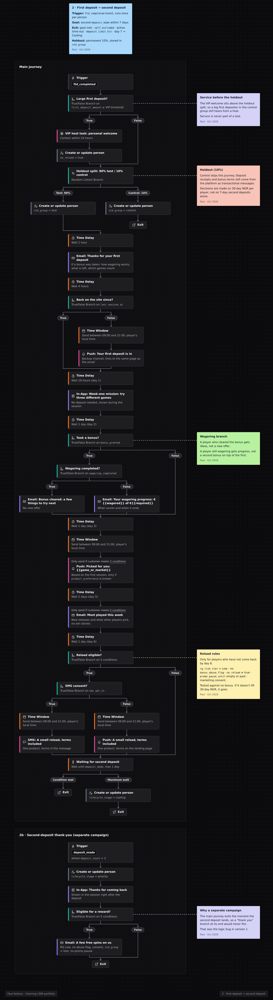
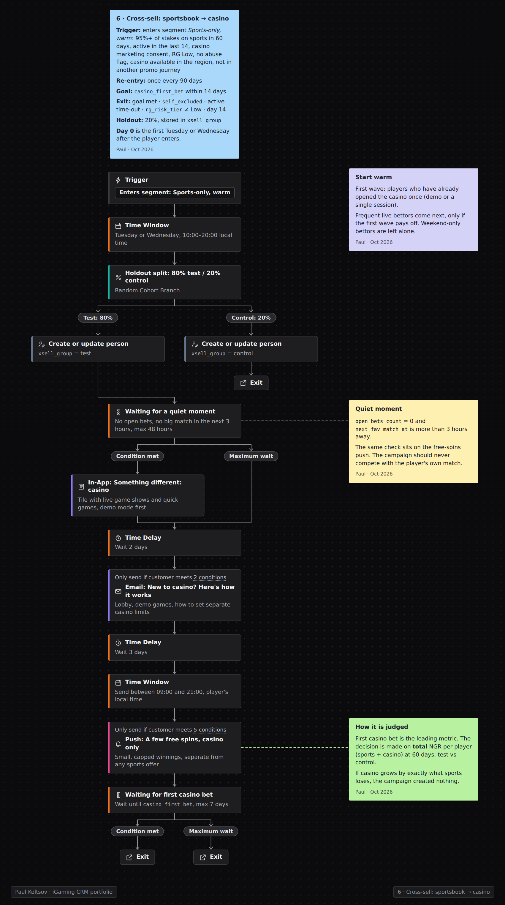

# Портфолио iGaming CRM - Павел Кольцов

*English version: [README.md](README.md)*

Я перехожу в iGaming CRM из операционного управления. Это моё портфолио на позицию Junior CRM: lifecycle-сценарии, которые я собрал в Customer.io, типовые CRM-задачи, которые я разобрал, и мой взгляд на ответственную игру.

## Коротко
- **6 lifecycle-сценариев** в Customer.io от регистрации до VIP, к каждому написан плейбук
- **10 CRM-кейсов** по шагам, в каждом показано, как я бы измерял результат против контрольной группы
- **Правила по ответственной игре и бонус-абьюзу** на основе руководства UK Gambling Commission
- Одинаковое содержание на русском и английском

## Если у вас 5 минут
1. [Кейс 05: как читать отчёт win-back кампании](ru/cases/05-reading-a-campaign-report.md) - почему "реактивировано 3 040 игроков" на деле около 475 дополнительных депозитов
2. [Плейбук 03: многоуровневая реактивация](ru/playbook/03-tiered-reactivation.md) - как устроен сценарий, шаг за шагом
3. [Ответственная игра и бонус-абьюз](ru/responsible-gaming/README.md) - кому CRM не должен писать и почему

## Воркфлоу в Customer.io
Нажмите, чтобы открыть скриншот.

1. Онбординг: регистрация -> первый депозит

[Читать плейбук](ru/playbook/01-onboarding-to-ftd.md)

2. Первый депозит -> второй

[Читать плейбук](ru/playbook/02-post-ftd-second-deposit.md)

3. Многоуровневая реактивация

[Читать плейбук](ru/playbook/03-tiered-reactivation.md)

4. VIP-цикл на событиях

[Читать плейбук](ru/playbook/04-event-driven-vip.md)

5. Возврат после неудачного депозита

[Читать плейбук](ru/playbook/05-failed-deposit-recovery.md)

6. Кросс-селл: спорт -> казино

[Читать плейбук](ru/playbook/06-sportsbook-to-casino-cross-sell.md)

## Принципы, по которым я работаю
1. **Кампания стоит ровно столько, сколько она вызвала.** Считаю разницу со случайной контрольной группой. Число откликнувшихся само по себе ничего не говорит.
2. **Решают деньги.** Смотрю на инкрементальный NGR после стоимости бонусов и каналов. Открытия, клики и число взятых бонусов - вспомогательные цифры.
3. **Изменение метрики - это симптом.** Сначала понять причину, потом решать, что отправлять.
4. **Поведение, а не календарь.** Сценарий начинается с действия игрока и заканчивается, когда он достиг цели.

## Что здесь есть

| Раздел | Русский | English |
|---|---|---|
| Плейбук: шесть lifecycle-кампаний от регистрации до VIP | [ru/playbook](ru/playbook/README.md) | [en/playbook](en/playbook/README.md) |
| Кейсы: 10 типовых CRM-задач по шагам | [ru/cases](ru/cases/README.md) | [en/cases](en/cases/README.md) |
| Ответственная игра и бонус-абьюз | [ru/responsible-gaming](ru/responsible-gaming/README.md) | [en/responsible-gaming](en/responsible-gaming/README.md) |
| 12 вопросов CRM iGaming и моя позиция | [ru/perspectives](ru/perspectives/README.md) | [en/perspectives](en/perspectives/README.md) |

Цифры в кейсах условные. Воркфлоу настоящие: все шесть я собрал сам в Customer.io, скриншоты лежат в папке [workflows](workflows). Word-версии всех документов лежат в `ru/word` и `en/word`.

## Обо мне
- Почти шесть лет основатель и операционный управляющий сети общепита (запустил, масштабировал, продал); раньше руководил отделом продаж и франчайзинга.
- Бэкенд-разработчик на Python (Яндекс Практикум), Telegram-боты и автоматизация.
- Сертификаты: Customer.io Platform Training, SumSub (Fraud Prevention, AML Transaction Monitoring), Casino Guru Academy (Player Verification & AML; Customer Support & Complaints), Chainalysis, HubSpot Inbound Marketing.
- Русский (родной), английский (свободный), немецкий (базовый). Нахожусь в Бангкоке (GMT+7), удалённая работа, готов к релокации.

## Контакты
[LinkedIn](https://www.linkedin.com/in/eminencesaul) | p.kolt080@gmail.com
