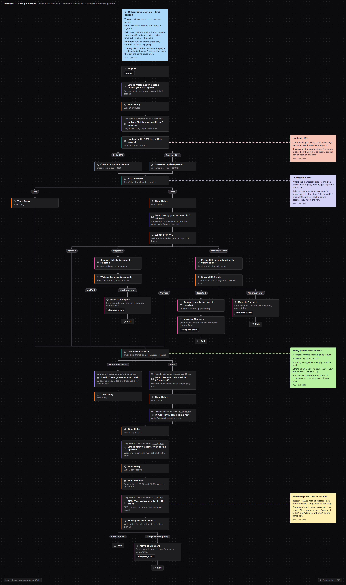

# Onboarding: sign-up -> first deposit

## Workflow in Customer.io

## Problem
Most people who register never make a deposit. The first days decide everything: interest is highest right after sign-up and fades fast. Often the problem is that verification drags on or the payment doesn't go through.

## Audience and exclusions
- **Entry:** `signup` event.
- **Exit:** first deposit, self-exclusion, day 7.
- **Excluded from promo steps:** no consent for the channel; identity or age not verified where the market requires it before play.

## Journey
| When | Channel | Message | Condition |
|---|---|---|---|
| 0 min | Email | Welcome: what happens next (verification -> getting to know the product -> deposit) | everyone |
| +10 min | In-app | Complete your profile | profile not complete |
| +2 h | Email | Verification in 5 minutes: how to do it, which documents work | not verified |
| +24 h | Email / push | Verification reminder with a link to support | still under review |
| Day 1 | Email + in-app | Games or markets popular in their country | verified |
| Day 2 | In-app | Try a demo game | verified, interested in casino |
| Day 3 | Email | Welcome offer with key terms | consent for this product |
| Day 5 | SMS | A calm reminder about the welcome offer | SMS consent, no deposit yet |
| Day 7 | | Exit -> rare content sends (*Sleepers*) | no deposit |

Failed deposit at any step -> exit into the "failed deposit recovery" journey.

## Offer rules
A deposit bonus or a free bet with reasonable wagering, one product per offer. No boosted offer for people who haven't deposited yet: a big bonus mostly attracts people who came for the bonus.

## KPI
- **Primary:** first deposit within 7 days of sign-up.
- **Secondary:** share of verified players, time to first deposit, second deposit within 7 days of the first (quality of the new depositor).
- **Guardrails:** unsubscribes, share of new depositors later flagged as bonus abusers.

## Measurement
Verification and transactional messages go to everyone. Promo steps have a 5-10% holdout. I read results by acquisition channel, because the channel mix shifts the overall number.

## Why it's built this way
Verification first, because you can't sell anything to a player who can't deposit yet.

Product before bonus, because a player who found a game they like deposits more willingly than one who came for €100 for free.

Channels step up, because the cheap channels should do the work first, and only then the expensive ones.
