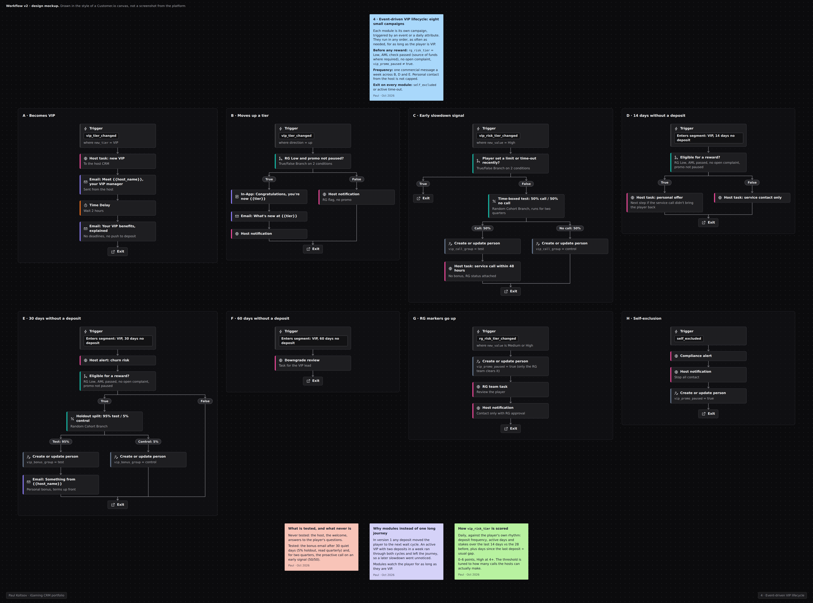

# Event-driven VIP cycle

> **In short:** VIP retention is built on relationships, and CRM tells the VIP manager in time what's happening with the player: became VIP, moved up, slowed down, went quiet, shows risk markers.

## Workflow in Customer.io

## Task

Usually a small group of players brings the casino most of its revenue. Losing one VIP can cost more than a mass campaign earns, and a manager who learns about a slowdown 30 days later is usually already too late. At the same time, high play intensity is both a VIP signal and a risk signal, so every commercial action goes through RG and AML.

**Hypothesis:** a service contact from the manager within 48 hours of an early slowdown signal keeps a VIP better than a bonus after 30 days of silence, and costs less.

## Campaign card

| Parameter | Value |
|---|---|
| Type | a set of triggered modules on events and attribute changes |
| Audience | `vip_tier` = VIP or Super VIP |
| Main events | `vip_tier_changed`, `deposit_made`, `vip_risk_tier_changed`, `rg_risk_tier` changed, `self_excluded` |
| Goal | a deposit in every 30-day window, NGR per VIP |
| Global exit | self-exclusion or time-out -> compliance notification, all modules stop |
| Priority | above onboarding and reactivation; below service and failed deposit |
| Channels | VIP manager (main), email, in-app, SMS only if the manager decides |
| Holdout | 5% on the VIP bonus email after 30 days of silence, group fixed per player in `vip_bonus_group`; 50/50 on proactive calls after an early signal (a time-limited test); basic service (manager, welcome, answering requests) is never tested |
| Owners | CRM (signals, messages), VIP managers (contact, offers), Head of VIP (downgrades), RG/compliance |

## Eligibility and conditions

- **Before any VIP reward:** RG risk Low, AML check passed (including source of funds where required), no open complaint or review.
- **A sharp rise in play** (deposits, session time, stakes above the player's usual level) is a signal for the RG team first.
- **A sharp drop** can be the player's own decision to play less. The manager sees the RG status and any limits before calling.

## Early signal: how `vip_risk_tier` is calculated

The attribute is recalculated every day and compares the player with their own rhythm:

| Signal | Comparison | Points |
|---|---|---|
| Deposit frequency | last 14 days vs the 28 days before: below half | 2 |
| Activity | active days, below half of normal | 1 |
| Stake | betting volume, below half of normal | 1 |
| Overdue | days since last deposit ÷ the player's usual gap: above 2 | 2 |

4 points or more - High.

## Journey: modules

| Module | Trigger | Actions | Owner | Conditions |
|---|---|---|---|---|
| A. VIP entry | `vip_tier_changed` -> VIP | 1) task for the manager via webhook; 2) "meet your manager" email from the manager; 3) 2 h later, an email about benefits | CRM + manager | not self-excluded |
| B. Tier upgrade | `vip_tier_changed` up | in-app congratulations; email about the new tier's benefits; notification to the manager | CRM | RG Low |
| C. Early signal | `vip_risk_tier_changed` -> High | task for the manager: contact within 48 h, service only (is everything ok, what can we improve, a relevant event or game), **no bonus** | manager | RG status visible to the manager before the call; no recent limit or time-out set by the player |
| D. 14 days without a deposit | attribute `days_since_deposit = 14` | personal offer from the manager after an RG/AML check; this is the next step if the service contact (C) didn't bring the player back | manager + CRM | RG Low, AML passed |
| E. 30 days without a deposit | `days_since_deposit = 30` | churn risk notification to the manager; random 95/5 split; 95% - personal VIP email with a bonus; wait 30 days for a deposit | CRM | RG Low, AML passed |
| F. 60 days without a deposit | `days_since_deposit = 60` | downgrade signal, VIP review | Head of VIP | |
| G. RG markers rising | `rg_risk_tier` -> Medium or High | all promos paused, task for the RG team, the manager gets a "only with RG approval" notice | RG / compliance | |
| H. Self-exclusion | `self_excluded` | notification to compliance and the manager, all modules stop | compliance | |

The modules are independent and can fire in any order, any number of times during the player's VIP life. B, D and E share a cap: no more than one commercial message to a VIP a week, not counting personal contact with the manager.

## Offers

- Service before bonuses. A VIP who learns that going quiet gets them gifts will go quiet more often.
- Personal offers are decided by the manager within the budget set by the Head of VIP.
- The cost of VIP rewards is tracked as a share of VIP GGR.
- VIP cashback (if there is one) gets its own 10% holdout: it's often one of the biggest bonus lines, and it's rarely tested.

## Copy: must-haves

- Emails come from a named manager, with their contact details.
- No urgency and no tier chasing ("deposit another €500 by Friday to get the status").
- A holdout in VIP emails too.

## Measurement

| Metric | What it shows |
|---|---|
| **Primary:** VIP retention (a deposit in every 30-day window), NGR per VIP | whether the programme works |
| Manager response time on tasks, share of completed contacts | whether the process works |
| Tier upgrades | growth |
| **Guardrails:** RG risk changes among VIPs, complaints, VIP reward cost / VIP GGR | cost and risk |

- **Bonus email after 30 days of silence (module E):** 5% holdout, results accumulated over a quarter or longer.
- **Calls after an early signal (module C):** a 50/50 test among high-risk VIPs for a limited period (two quarters). Primary KPI - deposit within 30 days, secondary - 60-day NGR.
- **Backtest of the score before launch:** precision, recall and lead time vs the "14 days without a deposit" rule.
