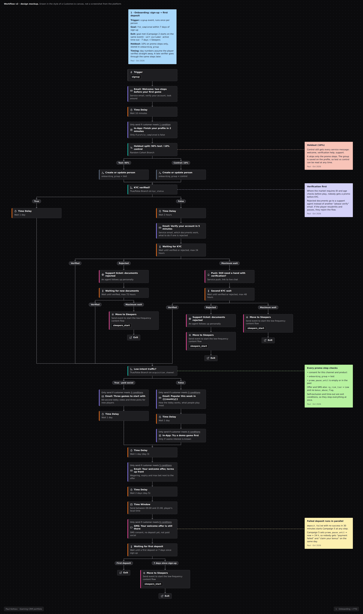

# Онбординг: регистрация -> первый депозит

## Воркфлоу в Customer.io

## Проблема
Большинство зарегистрировавшихся так и не делают депозит. Всё решают первые дни: интерес выше всего сразу после регистрации и быстро гаснет. Часто проблема в том, что верификация затягивается или не проходит платёж.

## Аудитория и исключения
- **Вход:** событие `signup`.
- **Выход:** первый депозит, самоисключение, 7-й день.
- **Исключены из промо-шагов:** нет согласия на канал; не подтверждены личность или возраст там, где рынок требует этого до начала игры.

## Сценарий
| Когда | Канал | Сообщение | Условие |
|---|---|---|---|
| 0 мин | Email | Приветствие: что дальше (верификация -> знакомство -> депозит) | все |
| +10 мин | In-app | Заполните профиль | профиль не заполнен |
| +2 ч | Email | Верификация за 5 минут: как пройти, какие документы подходят | не верифицирован |
| +24 ч | Email / push | Напоминание о верификации со ссылкой на поддержку | всё ещё на проверке |
| День 1 | Email + in-app | Игры или рынки, популярные в его стране | верифицирован |
| День 2 | In-app | Попробуйте демо-игру | верифицирован, интерес к казино |
| День 3 | Email | Приветственный оффер с ключевыми условиями | согласие на этот продукт |
| День 5 | SMS | Спокойное напоминание о приветственном оффере | согласие на SMS, депозита ещё нет |
| День 7 | | Выход -> редкие контентные рассылки (*Sleepers*) | депозита нет |

Неудачный депозит на любом шаге -> выход в сценарий "возврат после неудачного депозита".

## Правила офферов
Бонус на депозит или фрибет с разумным отыгрышем, один продукт на оффер. Никакого увеличенного оффера тем, кто ещё не внёс депозит: крупный бонус в основном привлекает тех, кто пришёл ради бонуса.

## KPI
- **Главный:** первый депозит в течение 7 дней после регистрации.
- **Дополнительные:** доля верифицированных, время до первого депозита, второй депозит в течение 7 дней после первого (качество нового депозитора).
- **Ограничители:** отписки, доля новых депозиторов, которых позже отметили как бонус-абьюзеров.

## Измерение
Сообщения о верификации и транзакционные уходят всем. На промо-шагах холдаут 5-10%. Результаты смотрю по каналам привлечения, потому что микс каналов сдвигает общую цифру.

## Почему так устроено
Сначала верификация, потому что игроку, который пока не может внести депозит, ничего не продашь.

Продукт раньше бонуса, потому что игрок, который нашёл понравившуюся игру, охотнее вносит депозиты, чем тот, кто пришёл за €100 бесплатно.

Каналы по нарастающей, потому что сначала работу должны сделать дешёвые каналы, а уже потом дорогие.