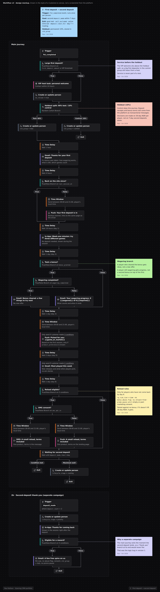

# Первый депозит -> второй депозит

> **Кратко:** первая неделя после первого депозита решает, останется ли игрок. Сценарий объясняет бонус и отыгрыш, даёт причину вернуться без денег и только в конце, и только тем, кто не вернулся, предлагает небольшой reload. Цель - второй депозит (STD) за 7 дней.

## Воркфлоу в Customer.io

## Задача

Первый депозит может быть любопытством или охотой за бонусом. Второй показывает, что продукт понравился настолько, что игрок готов платить снова. CRM-команды обычно считают STD самым ранним надёжным признаком будущей ценности игрока. Если второй депозит не случился в первые дни, позже он случается редко.

**Гипотеза:** понятный бонус, привычка первой недели и персональные рекомендации поднимают STD сильнее, чем ранний reload, и стоят дешевле.

## Паспорт кампании

| Параметр | Значение |
|---|---|
| Тип | триггерная, по событию |
| Триггер | `ftd_completed` |
| Повторный вход | нет |
| Цель (конверсия) | `deposit_made` (второй депозит) в течение 7 дней |
| Выход | второй депозит -> *Priority* (с благодарностью); самоисключение, тайм-аут или `deposit_limit_hit` -> выход без сообщений; 7 дней без депозита -> *Cooling* |
| Приоритет | как онбординг: выше реактивации и кросс-селла |
| Каналы | email, in-app, push, SMS (один раз, в конце) |
| Холдаут | постоянные 10% в момент FTD, группа в `std_group` |
| Владелец | CRM; VIP-команда для крупных первых депозитов |

## Аудитория, допуск и исключения

- **Вход:** все новые депозиторы.
- **Без офферов с привязкой к депозиту:** RG-риск Medium или High.
- **Без бонусов вообще:** флаг бонус-абьюза.
- **Выход при `deposit_limit_hit`:** игрок, который упёрся в свой лимит.

## Сценарий

| № | Когда | Канал / блок | Содержание | Условие отправки |
|---|---|---|---|---|
| 1 | +1 ч | Email; push, только если письмо не открыто за 4 ч | Спасибо за депозит; если взят бонус - как работает отыгрыш, сколько осталось, какие игры засчитываются | все; блок про бонус только при `bonus_granted` |
| 1a | +1 ч | Сообщение VIP-менеджеру | Крупный первый депозит: личное приветствие в течение 24 ч | `first_deposit_amount` выше порога |
| 2 | день 1 | In-app | Миссия первой недели, для которой не нужен депозит (например, попробовать три разные игры) | активен на сайте |
| 3 | день 2 | Ветка | `wagering_completed`? | был бонус |
| 3a | день 2 | Email | Бонус отыгран: что попробовать дальше (без нового оффера) | отыгрыш завершён |
| 3b | день 2 | Email | Прогресс отыгрыша: сколько осталось, как не потерять бонус | отыгрыш не завершён |
| 4 | дни 3-4 | Push | Персональная рекомендация игры или рынка по первой сессии | `product_preference` известен |
| 5 | день 5 | Email | Самое популярное за неделю, новинки | второго депозита нет |
| 6 | день 6 | SMS или push | Небольшой reload: один продукт, простые условия | второго депозита нет, RG Low, нет флага абьюза, не крупный первый депозит; для SMS - согласие на SMS и дневное время |
| 7 | до дня 7 | Ожидание цели | второй депозит -> *Priority*; нет -> *Cooling*, выход | |

**Благодарность за второй депозит** - отдельная маленькая кампания по событию `deposit_made` при `deposit_count = 2`: in-app "спасибо" и, если игрок допущен, небольшие фриспины. Она живёт отдельно, потому что основной сценарий завершается в момент депозита.

## Офферы

- Reload только на 6-й день и только тем, кто не вернулся. Ранний reload в основном оплачивает игроков, которые внесли бы депозит и так.
- Один продукт на оффер, низкий отыгрыш, ключевые условия рядом.
- Никакого нового бонуса игроку, который ещё отыгрывает первый.

## Измерение

| Метрика | Что показывает |
|---|---|
| **Главная:** STD за 7 дней | работает ли сценарий |
| STD за 30 дней | если разрыв на 30 днях намного меньше, чем на 7, сценарий в основном ускоряет депозиты, которые и так бы случились |
| NGR на игрока за 30 дней | деньги после бонусов |
| Стоимость бонусов на нового депозитора | во что обходится результат |

- **Дизайн:** постоянный холдаут 10% в момент FTD. Новые версии тестируются 50/50 против текущей внутри тестовой группы.
- **Выручку на игрока перекашивают несколько крупных игроков**, поэтому для денег считаю бутстреп-интервал: одно среднее здесь легко обманывает.
- **Отдельный тест:** SMS-reload на 6-й день против отсутствия бонуса. Если STD без него такой же, reload убираем.
- **Отчёт:** еженедельно STD за 7 дней по когортам FTD; раз в месяц 30-дневные цифры и инкрементальность.