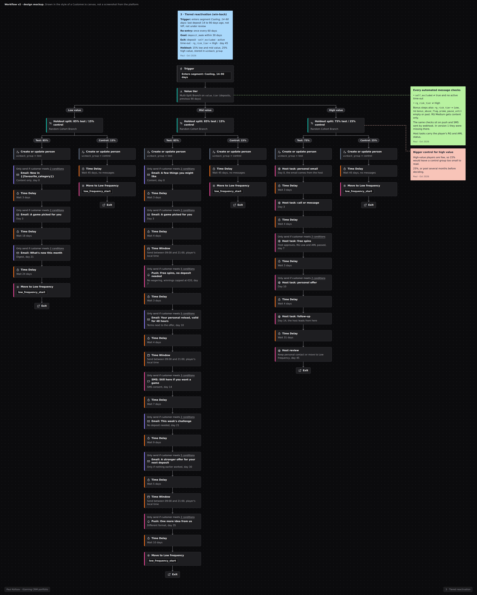

# Многоуровневая реактивация: остывающие -> в зоне риска -> спящие

> **Кратко:** win-back для игроков, которые перестали вносить депозиты. Сначала контент, деньги только если контент не сработал, самый крупный оффер только тем, чей возврат того стоит. Обязательная случайная контрольная группа. Цель - депозит за 30 дней.

## Воркфлоу в Customer.io

## Задача

Уходящие игроки - самая большая группа, до которой может дотянуться CRM, и многие из них возвращаются сами. Если вернулись 30% тех, кому мы писали, это не значит, что кампания вернула 30%: она вернула разницу между ними и контрольной группой. Win-back должен тратить контакты и бонусы только там, где они меняют результат.

## Паспорт кампании

| Параметр | Значение |
|---|---|
| Тип | триггерная, по входу в сегмент |
| Вход | последний депозит 14-90 дней назад (точка 14 дней уточняется по кривой естественного возврата) |
| Повторный вход | не чаще одного раза в 60 дней |
| Цель (конверсия) | `deposit_made` в течение 30 дней после входа |
| Выход | депозит -> *Priority*; самоисключение или тайм-аут; RG High; 45-й день -> *Low frequency* |
| Приоритет | ниже онбординга, второго депозита и VIP; выше кросс-селла |
| Каналы | email, push, SMS; для высокой ценности VIP-менеджер |
| Холдаут | 15% на входе; 25% для высокой ценности |
| Владелец | CRM; VIP-команда ведёт высокий уровень |

## Аудитория, допуск и исключения

- **Уровень ценности на входе** (`value_tier`, по депозитам за предыдущие 90 дней): низкий, средний, высокий. Пороги задаются по распределению базы, например нижние 50%, следующие 40%, верхние 10%.
- **Исключены:** RG High (и это же условие выхода); игроки, которые уже в VIP-сценарии возврата, игроки под проверкой Risk/AML.
- **Без бонусных шагов:** флаг абьюза, RG Medium (у них остаётся только контент).
- **Предусловия на каждом сообщении**, включая SMS и push через вебхук: `self_excluded != true`, `rg_risk_tier != High`, нет активного тайм-аута.

## Сценарий

**Вход и деление**

| № | Блок | Что происходит |
|---|---|---|
| 0 | Вход в сегмент | игрок попал в *Cooling* (14-90 дней без депозита) |
| 0a | Случайное деление | 85% - сценарий, 15% - контроль (для высокой ценности 75/25); группа пишется в `winback_group` |
| 0b | Контроль | ничего не получает 45 дней, его депозиты считаются так же |
| 0c | Ветка по `value_tier` | низкий / средний / высокий |

**Шаги по уровням**

| День | Низкая ценность | Средняя ценность | Высокая ценность |
|---|---|---|---|
| 0 | Email: персональный игровой контент (новинки в его любимой категории) | Email: "как дела?" + персональный контент | Задача VIP-менеджеру; личный email от менеджера |
| 3 | Email: рекомендация игры | Email: рекомендация игры | Звонок или сообщение от менеджера |
| 7 | - | Push: фриспины без депозита, с лимитом выигрыша | Фриспины, согласованные менеджером |
| 10 | - | Email: персональный reload, срок 48 ч, условия рядом | Персональный оффер от менеджера |
| 14 | - | SMS: последний толчок | Повторный контакт менеджера |
| 21 | Email: дайджест новинок | Email: игровой челлендж (геймификация) | Ведёт менеджер |
| 30 | - | Email: "мы скучаем" + оффер посильнее, если предыдущие не сработали | Ведёт менеджер |
| 35 | - | SMS или push: последний контакт, другой формат | - |
| 45 | Выход -> *Low frequency* | Выход -> *Low frequency* | Ревью менеджера: продолжить личный контакт или перевести в *Low frequency* |

Каждый шаг отправляется, только если у игрока ещё нет депозита и он проходит предусловия. Если RG-риск вырос до High посреди сценария, следующий шаг не отправляется, и игрок выходит.

## Офферы

- **Фриспины вместо кэшбэка.** Фриспины дают небольшой ограниченный повод снова попробовать игру. Кэшбэк возвращает часть проигрыша, а это может подталкивать отыгрываться.
- **По нарастающей.** Стимул растёт, только если дешёвый шаг не сработал.
- **Размер оффера** выбирается тестом. По умолчанию самый дешёвый вариант, который работает; более крупный - для более ценных игроков.
- **Низкая ценность** получает только контент: бонус там стоит больше, чем приносит вернувшийся игрок.

## Измерение

| Метрика | Что показывает |
|---|---|
| **Главная:** депозит за 30 дней, тест против контроля, в процентных пунктах | реальный эффект сценария |
| То же на 7-й и 14-й день | как быстро набирается эффект |
| Инкрементальный NGR на игрока из тестовой группы минус стоимость каналов | окупается ли сценарий |
| Депозиты за 60 дней после возврата | остался ли игрок или пришёл за одним оффером |
| Стоимость бонусов на один инкрементальный возврат | цена результата |
| **Защитные:** отписки, жалобы на спам, изменения RG-риска | цена для базы и для игрока |