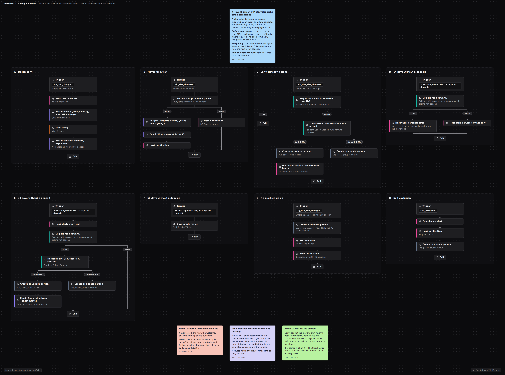

# VIP-цикл на событиях

> **Кратко:** удержание VIP строится на отношениях, а CRM вовремя сообщает VIP-менеджеру, что происходит с игроком: стал VIP, вырос, замедлился, затих, показывает признаки риска.

## Воркфлоу в Customer.io

## Задача

Обычно небольшая группа игроков приносит казино большую часть выручки. Потеря одного VIP может стоить больше, чем зарабатывает массовая кампания, а менеджер, который узнаёт о спаде через 30 дней, как правило, уже опоздал. При этом высокая интенсивность игры - это одновременно VIP-сигнал и сигнал риска, поэтому каждое коммерческое действие проходит через RG и AML.

**Гипотеза:** сервисный контакт менеджера в первые 48 часов после раннего сигнала спада удерживает VIP лучше, чем бонус после 30 дней тишины, и стоит дешевле.

## Паспорт кампании

| Параметр | Значение |
|---|---|
| Тип | набор триггерных модулей по событиям и смене атрибутов |
| Аудитория | `vip_tier` = VIP или Super VIP |
| Главные события | `vip_tier_changed`, `deposit_made`, `vip_risk_tier_changed`, `rg_risk_tier` изменился, `self_excluded` |
| Цель | депозит в каждом 30-дневном окне, NGR на VIP |
| Глобальный выход | самоисключение или тайм-аут -> комплаенс-уведомление, все модули останавливаются |
| Приоритет | выше онбординга и реактивации; ниже сервиса и неудачного депозита |
| Каналы | VIP-менеджер (главный), email, in-app, SMS только по решению менеджера |
| Холдаут | 5% на VIP-письме с бонусом после 30 дней тишины, группа закреплена за игроком в `vip_bonus_group`, 50/50 на проактивных звонках по раннему сигналу (тест на ограниченный срок); базовый сервис (менеджер, приветствие, ответы на обращения) не тестируется никогда |
| Владельцы | CRM (сигналы, сообщения), VIP-менеджеры (контакт, офферы), руководитель VIP (понижения), RG/комплаенс |

## Допуск и условия

- **Перед любым VIP-вознаграждением:** RG-риск Low, пройдена AML-проверка (включая источник средств, где это требуется), нет открытой жалобы или проверки.
- **Резкий рост игры** (депозиты, время сессий, ставки выше привычного уровня игрока) - сначала сигнал для RG-команды.
- **Резкий спад** может быть осознанным решением игрока сократить игру. Менеджер видит RG-статус и наличие лимитов до звонка.

## Ранний сигнал: как считается `vip_risk_tier`

Атрибут пересчитывается каждый день и сравнивает игрока с его собственным ритмом:

| Сигнал | Сравнение | Баллы |
|---|---|---|
| Частота депозитов | последние 14 дней против 28 дней до этого: ниже половины | 2 |
| Активность | активные дни, ниже половины нормы | 1 |
| Ставка | объём ставок, ниже половины нормы | 1 |
| Просрочка | дни с последнего депозита ÷ обычный интервал игрока: больше 2 | 2 |

4 балла и больше - High

## Сценарий: модули

| Модуль | Триггер | Действия | Ответственный | Условия |
|---|---|---|---|---|
| A. Вход в VIP | `vip_tier_changed` -> VIP | 1) задача менеджеру через вебхук; 2) email "знакомьтесь, ваш менеджер" от имени менеджера; 3) через 2 ч email о привилегиях | CRM + менеджер | нет самоисключения |
| B. Повышение уровня | `vip_tier_changed` вверх | in-app поздравление; email о привилегиях нового уровня; уведомление менеджеру | CRM | RG Low |
| C. Ранний сигнал | `vip_risk_tier_changed` -> High | задача менеджеру: контакт в течение 48 ч, только сервис (всё ли в порядке, что улучшить, подходящее событие или игра), **без бонуса** | менеджер | RG-статус виден менеджеру до звонка; нет свежего лимита или тайм-аута, поставленного игроком |
| D. 14 дней без депозита | атрибут `days_since_deposit = 14` | персональный оффер от менеджера после проверки RG/AML; это следующий шаг, если сервисный контакт (C) не вернул игрока | менеджер + CRM | RG Low, AML пройден |
| E. 30 дней без депозита | `days_since_deposit = 30` | уведомление менеджеру о риске оттока; случайное деление 95/5; 95% - персональное VIP-письмо с бонусом; ждать депозит 30 дней | CRM | RG Low, AML пройден |
| F. 60 дней без депозита | `days_since_deposit = 60` | сигнал на понижение, VIP-ревью | руководитель VIP | |
| G. Растут RG-маркеры | `rg_risk_tier` -> Medium или High | все промо на паузе, задача RG-команде, менеджер получает уведомление "только по согласованию с RG" | RG / комплаенс | |
| H. Самоисключение | `self_excluded` | уведомление в комплаенс и менеджеру, остановка всех модулей | комплаенс | |

Модули независимы и могут срабатывать в любом порядке, сколько угодно раз за жизнь игрока в VIP. Между B, D и E действует общий лимит: не больше одного коммерческого сообщения VIP в неделю, не считая личного общения с менеджером.

## Офферы

- Сервис раньше бонусов. VIP, который понял, что за затишье дарят подарки, будет затихать чаще.
- Персональные офферы решает менеджер в пределах бюджета, который задаёт руководитель VIP.
- Стоимость VIP-вознаграждений отслеживается как доля VIP GGR.
- VIP-кэшбэк (если он есть) получает собственный холдаут 10%: это часто одна из самых крупных бонусных статей, и её редко тестируют.

## Тексты: что обязательно

- Письма идут от имени конкретного менеджера, с его контактом.
- Никакой срочности и никакой гонки за уровнем ("внесите ещё €500 до пятницы, чтобы получить статус").
- Холдаут и в VIP-письмах тоже.

## Измерение

| Метрика | Что показывает |
|---|---|
| **Главные:** удержание VIP (депозит в каждом 30-дневном окне), NGR на VIP | работает ли программа |
| Скорость реакции менеджеров на задачи, доля выполненных контактов | работает ли процесс |
| Повышения уровня | рост |
| **Защитные:** изменения RG-риска среди VIP, жалобы, стоимость VIP-вознаграждений / VIP GGR | цена и риск |

- **Письмо с бонусом после 30 дней тишины (модуль E):** холдаут 5%, результаты накопительно за квартал или дольше.
- **Звонки по раннему сигналу (модуль C):** тест 50/50 среди VIP с высоким риском на ограниченный срок (два квартала). Главный KPI - депозит за 30 дней, дополнительный - NGR за 60 дней.
- **Бэктест скоринга до запуска:** точность, полнота и запас по времени против правила "14 дней без депозита".