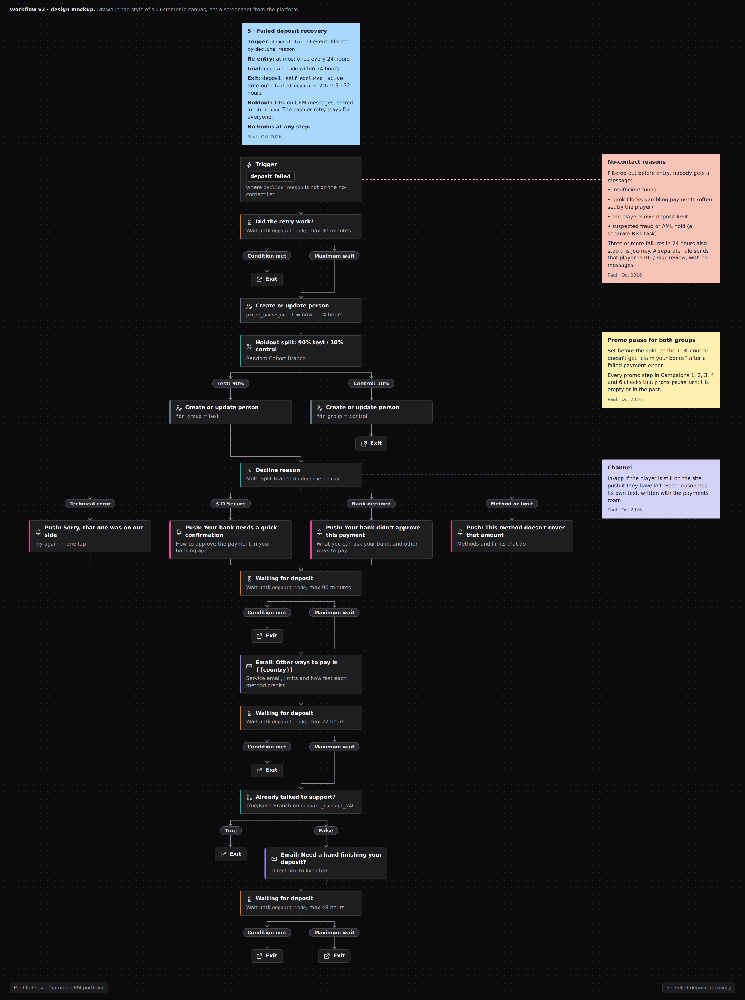

# Возврат после неудачного депозита

> **Кратко:** игрок уже решил заплатить, но платёж не прошёл. Его не нужно уговаривать, ему нужно помочь: объяснить причину, предложить другой способ оплаты, подключить поддержку. Никаких бонусов, а при некоторых причинах отказа никаких сообщений вообще. Цель - успешный депозит за 24 часа.

## Воркфлоу в Customer.io

## Задача

Неудачный депозит - самый дорогой момент воронки: намерение уже есть, а деньги не дошли. Многие, у кого не прошла первая попытка, больше не пробуют. Особенно это бьёт по первому депозиту, где игрок ещё не привязан к продукту.

**Гипотеза:** понятное объяснение причины и альтернативный способ оплаты в первые часы после отказа поднимают долю успешных депозитов без какого-либо стимула.

## Паспорт кампании

| Параметр | Значение |
|---|---|
| Тип | триггерная, по событию |
| Триггер | `deposit_failed` и нет успешного депозита в течение 30 минут |
| Повторный вход | да, но не чаще раза в 24 ч; после 3 неудач за 24 ч - без сообщений, проверка RG/Risk |
| Цель (конверсия) | `deposit_made` в течение 24 ч |
| Выход | успешный депозит, самоисключение или тайм-аут, 72 часа |
| Приоритет | сразу после сервисных и комплаенс-сообщений, выше всех промо. Пока игрок здесь, промо-шаги других кампаний на паузе 24 ч |
| Каналы | in-app или push, email, приглашение в чат поддержки |
| Холдаут | 10% только на CRM-сообщения; собственный повтор в кассе остаётся у всех |
| Владельцы | CRM (сообщения), платежи (доля отказов, способы оплаты), поддержка (чат) |

## Что делаем по причине отказа

| Причина | Что делаем |
|---|---|
| Техническая ошибка, таймаут, сбой у провайдера | сценарий повтора: "попробуйте ещё раз", ссылка в кассу |
| 3-D Secure не пройден или прерван | короткая инструкция по подтверждению платежа в банковском приложении, повтор |
| Банк отклонил без пояснения | другие способы оплаты, доступные в стране игрока |
| Способ не поддерживается, превышен лимит способа | альтернативы и лимиты по каждому способу |
| **Недостаточно средств** | **никаких сообщений** |
| **Банк блокирует азартные платежи** | **никаких сообщений** и никаких альтернатив |
| **Сработал лимит депозита, который игрок поставил сам** | **никаких сообщений** |
| **Подозрение на фрод, AML-ограничение** | **никаких сообщений**, задача Risk |

Повторные неудачи (3 и больше за 24 часа) вместе с другими маркерами (рост частоты депозитов, ночные сессии) уходят на RG-проверку.

## Сценарий

| № | Когда | Канал / блок | Содержание | Условие отправки |
|---|---|---|---|---|
| 0 | событие | Фильтр | `decline_reason` из списка "без сообщений" -> выход без контакта | |
| 1 | +30 мин | In-app (если игрок на сайте) или push | "Платёж не прошёл": причина простыми словами, повтор в одно касание | нет успешного депозита |
| 2 | +2 ч | Email (сервисный) | Другие способы оплаты в его стране, их лимиты и сроки зачисления | нет депозита |
| 3 | +24 ч | Email или приглашение в чат | "Помочь завершить депозит?" с прямым входом в поддержку | нет депозита, игрок не писал в поддержку сам |
| 4 | 72 ч | Выход | Исходная кампания (онбординг, второй депозит) продолжает работу | |

Ни на одном шаге нет бонусов. Сообщения сервисные по смыслу и не содержат промо.

## Измерение

| Метрика | Что показывает |
|---|---|
| **Главная:** успешный депозит в течение 24 ч после неудачи, тест против контроля | работает ли сценарий |
| Доля первых депозитов среди игроков, у которых первая попытка не прошла | вклад в онбординг |
| Обращения в поддержку на одну неудачу | помогают ли сообщения или создают нагрузку |
| Доля отказов по способам оплаты и банкам | для команды платежей |
| **Защитные:** ноль сообщений после отказов из списка "без сообщений"; изменения RG-риска | безопасность |

- **Дизайн:** холдаут 10% только на CRM-сообщения.
- **Объёмы обычно небольшие**, поэтому результаты смотрю раз в квартал.
- **Аудит:** раз в месяц выборка отправленных сообщений сверяется с `decline_reason`, цель - ноль ошибок.