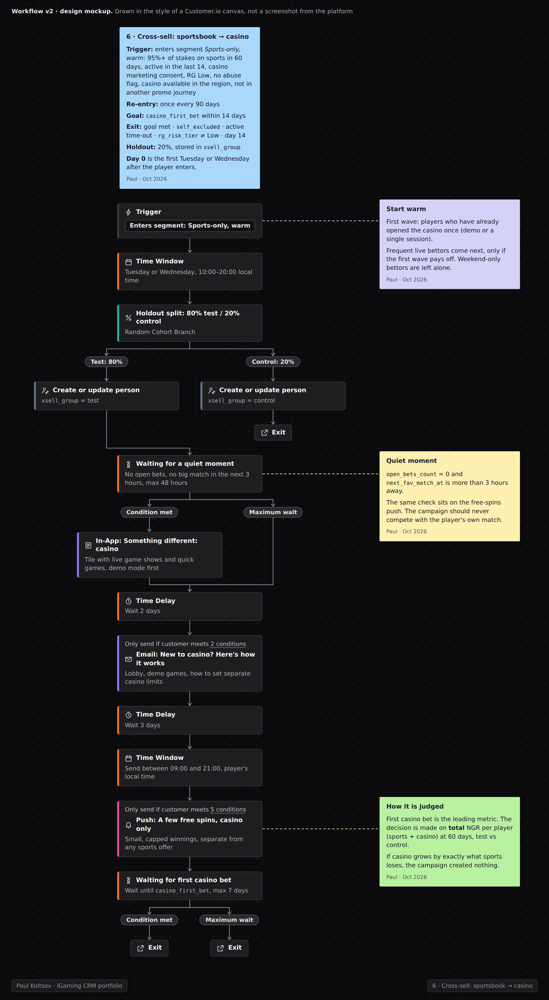

# Кросс-селл: спорт -> казино

> **Кратко:** познакомить с казино игроков на спорте, у которых уже есть хоть какой-то интерес к нему, в момент, когда они не заняты матчем. Сначала контент, потом небольшой стимул только на казино. Решение принимается по общему NGR игрока (спорт + казино), чтобы не принять перекладывание денег за рост.

## Воркфлоу в Customer.io

## Задача

Игроки, которые пользуются обоими продуктами, часто выглядят ценнее. Но это может значить лишь то, что вовлечённые игроки просто пробуют больше. Из корреляции не следует, что если навязать казино чистому беттеру, он станет ценнее. Кросс-селл имеет смысл, только если создаёт дополнительную ценность. Если деньги просто переехали из спорта в казино, мы ничего не заработали.

## Паспорт кампании

| Параметр | Значение |
|---|---|
| Тип | запланированная волна по сегменту, раз в неделю, в спокойный день |
| Вход | только спорт: почти все ставки (например, 95%+) за 60 дней на спорт; активен за последние 14 дней; согласие на маркетинг казино |
| Повторный вход | не чаще раза в 90 дней |
| Цель (конверсия) | первая ставка в казино (`casino_first_bet`) за 14 дней |
| Выход | первая ставка в казино; самоисключение или тайм-аут; RG-риск вырос; 14-й день |
| Приоритет | самый низкий среди промо-кампаний; не запускается, если игрок в любом другом промо-сценарии |
| Каналы | in-app, email, push |
| Холдаут | 20% (базовая конверсия низкая, нужен контроль побольше) |
| Владелец | CRM; RG-команда согласует критерии исключения |

## Аудитория, допуск и исключения

**Начинать с самых тёплых сегментов:**

| Сегмент | Ожидаемая реакция | Что делаем |
|---|---|---|
| Уже заходили в казино (демо, одна сессия) | самый высокий интерес | первая волна |
| Часто ставят на спорт, особенно live | вовлечены, им могут зайти быстрые игры | вторая волна, если первая окупилась |
| Ставят только по выходным, под крупные события | интерес низкий | не трогаем |
| Ценные игроки на спорте | осторожно: можно задеть основную выручку | только после результатов первых волн и с согласия VIP-команды |

## Сценарий

| № | Когда | Канал / блок | Содержание | Условие отправки |
|---|---|---|---|---|
| 0 | вход | Случайное деление | 80% - сценарий, 20% - контроль; группа в `xsell_group` | |
| 1 | день 0, спокойный момент | In-app | Плитка "Откройте казино": игры, близкие к интересам на спорте (live game shows, быстрые игры) | на сайте, нет открытых live-ставок |
| 2 | день 2 | Email | "Впервые в казино?": как устроено лобби, демо-игры, как поставить лимиты на казино отдельно | нет ставки в казино |
| 3 | день 5 | Push | Небольшие фриспины только для казино, простые условия, отдельно от любых спортивных офферов | нет ставки в казино, RG Low, нет флага абьюза |
| 4 | день 14 | Выход | Сконвертированные идут в обычную коммуникацию с учётом нового продукта | |

## Офферы

- Один продукт на один стимул. Фриспины - предложение только для казино, без общего бонуса на спорт и казино.
- Стимул только на шаге 3 и только тем, кто не попробовал казино после контента.
- Небольшой размер и лимит выигрыша: задача - дать попробовать.

## Измерение

| Метрика | Что показывает |
|---|---|
| **Главная:** первая ставка в казино за 14 дней | срабатывает ли знакомство |
| **Метрика для решения:** общий NGR на игрока (спорт + казино) за 60 дней, тест против контроля | создаёт ли кампания ценность |
| NGR на спорте отдельно, тест против контроля | есть ли каннибализация |
| **Защитные:** переходы между RG-уровнями среди сконвертированных, отказы от маркетинга казино | вред и раздражение |

- **Как читать:** если NGR казино вырос ровно на столько, на сколько упал спорт, кампания ничего не создала.
- **Холдаут 20%**, решение принимается не раньше 60 дней после волны.
- **Отчёт:** конверсия по волнам еженедельно, деньги и RG через 60 дней.